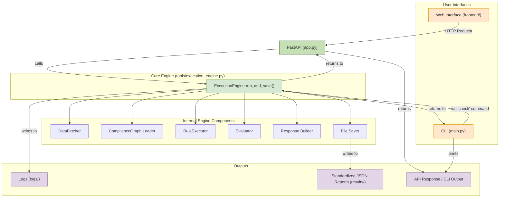

# Fincheck: Automated Financial Compliance System

Chapter 8: Input Company + Shareholder (with selectable options for demo convenience)

## 1. Project Overview

**Compliance-to-Code** is an intelligent engine designed to convert complex financial compliance regulations into executable and automatically verifiable code. It systematically checks whether corporate actions, especially those of listed companies—such as share buybacks and equity distributions—strictly comply with relevant laws, significantly enhancing the efficiency and accuracy of compliance audits.

### Core Features

- **Highly Modular**: Composed of highly cohesive and loosely coupled modules, including data extraction, rule execution, sandbox isolation, and result evaluation.
- **Configurable Regulations**: Complex regulations are decomposed into independent "Compliance Units," managed via structured JSON files (compliance graphs), allowing easy expansion and maintenance.
- **Sandboxed Execution**: All compliance rule code runs securely within isolated subprocesses, preventing unintended impacts on the main application and maintaining environmental integrity.
- **Robust Error Diagnostics**: Clearly differentiates between **business logic violations** (e.g., buyback prices outside allowable ranges) and **code execution errors** (e.g., bugs in the code), providing detailed logs.
- **Standardized Data Preprocessing**: Provides standardized data preprocessors for each regulation to ensure input data consistency and avoid potential data-type issues at their source.
- **Automated Compliance Report Generation**: Automatically analyzes compliance violations using large language models, generating professional compliance reports in Markdown format, including violation statistics, case analyses, and recommendations for rectification.
- **Unified Command-Line Interface**: Offers a streamlined, powerful CLI for conducting compliance checks and stress tests.

## 2. System Architecture

The system employs a layered architecture with clearly defined component responsibilities, cooperating seamlessly from data input to report output. The latest version introduces a Web interface for more intuitive user interaction.



## 3. Core Usage: Unified Execution Engine

The project centers around the `` (`tools/execution_engine.py`), encapsulating the complete process from data fetching and rule execution to result evaluation and file saving. Whether invoked via Web interface or CLI, calls converge at the unified entry point method `run_and_save`.

This design ensures:

- **Logical Consistency**: Identical core logic execution irrespective of invocation method.
- **Output Consistency**: Uniform output file and folder structures generated in the `results/` directory.

### Method 1: Web Interface (Recommended)

A visual Web interface is provided for running compliance checks and viewing results.


**Step 1: Launch Backend Service**

Add api key in **tools/call_gpt.py**

Run the following command from the project root to start the FastAPI backend:

```bash
python run_web_server.py
```

The service listens on port `8008`.

**Step 2: Access Web Interface**

Open your browser and navigate to:

[http://127.0.0.1:8008/](http://127.0.0.1:8008/)

**Step 3: Run Checks**

On the webpage:

1. Select a regulation from the dropdown.
2. Enter the company name.
   - Note: A selectable company list is automatically loaded.
   - When selecting regulation number eight (rules on shareholder and executive share reductions), an additional shareholder input field will appear for filtering.
3. Click the "Run Check" button.

Results are displayed as a **knowledge graph**, **compliance report**, and **raw JSON data**. Complete results are saved in the `results/` directory. Markdown and JSON files can be downloaded directly for archiving or further analysis.

### Method 2: Command-Line Interface (CLI)

Access different functionalities via the unified command-line entry point `main.py`.

#### 1. Compliance Check (`check`)

Conduct compliance checks on specified companies and regulations.

**Command Format:**

```bash
python main.py check --company <CompanyName> --regulation <RegulationID> [--start-date YYYY-MM-DD] [--end-date YYYY-MM-DD] [--shareholder <ShareholderName>]
```

**Example:**

```bash
# Regular check on "Yi Yu Environmental" for "Share Buyback" regulation
python main.py check --company YiYuEnvironmental --regulation regulation_04

# Check on "Jun Zhang Machinery" for "Shareholding Management" regulation, shareholder "Ma Yijing"
python main.py check --company JunZhangMachinery --regulation regulation_08 --shareholder MaYijing
```

A brief report appears in the console, and detailed results are saved in the `results/` directory.

#### 2. Additional Commands

```bash
# List companies for a specific regulation
python main.py list-companies --regulation regulation_04

# List shareholders for a regulation and company (regulation_08 only)
python main.py list-shareholders --regulation regulation_08 --company JunZhangMachinery

# Run stress tests (refer to the code for details)
python main.py stress-test --runs 50
```

## 4. Project File Structure

The project follows a modular file organization approach.

```
Compliance-to-Code-agent/
├── README.md
├── main.py
├── run_web_server.py
├── docs/
│   ├── architecture.md
│   ├── web_interface.md
│   └── shareholder_filter.md
├── frontend/
│   ├── index.html
│   ├── style.css
│   └── main.js
├── backend/
│   ├── app.py
│   ├── compliance_engine/
│   └── database/
├── tools/
│   ├── execution_engine.py
│   ├── data_fetcher.py
│   ├── call_gpt.py
│   └── compliance_report.py
├── data/
│   ├── company_data/
│   └── graphs/
├── logs/
└── results/
```

For more details on shareholder filtering, see [Shareholder Filtering Documentation](docs/shareholder_filter.md).

