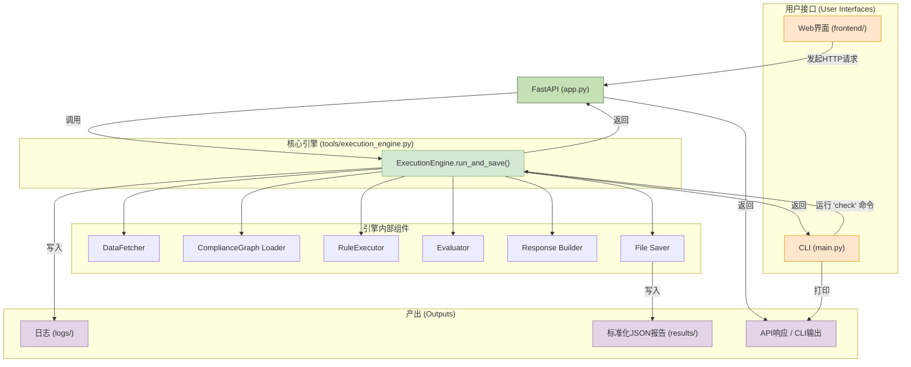
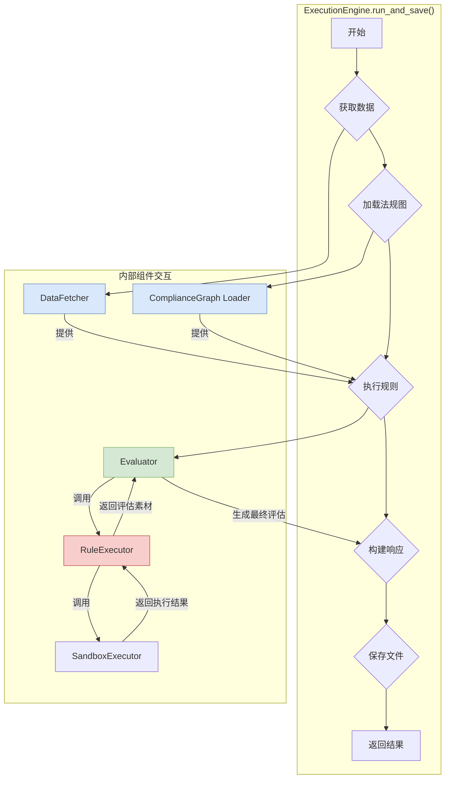

# 系统架构与实现详解

本文档深入剖析 **Compliance-to-Code** 项目的内部架构、核心组件、工作流以及关键技术决策。

## 1. 总体架构

系统采用高度中心化的设计，其核心是 **`ExecutionEngine`** 模块。该引擎封装了从数据获取、规则执行、结果评估到文件保存的完整流程，并提供了一个统一的入口方法 `run_and_save`。

无论是通过Web界面还是命令行(CLI)发起的请求，最终都会被路由到这个统一的入口。这种设计确保了：
- **逻辑一致性**: 任何调用方式都执行完全相同的核心逻辑。
- **输出一致性**: 任何调用方式都会在 `results/` 目录下生成格式完全相同的输出文件夹和文件。



## 2. 核心组件详解

### 2.1. `ExecutionEngine` - 统一流程编排器

- **文件**: `tools/execution_engine.py`
- **核心入口**: `run_and_save(company_name, regulation_id, ...)`
- **职责**: 作为整个系统的“中央处理器”，`run_and_save` 方法负责按顺序编排所有操作。

#### `ExecutionEngine` 内部工作流

下图详细展示了当 `run_and_save` 方法被调用后，引擎内部各个组件之间的交互顺序和数据流：



- **职责详解**:
  1.  **获取数据**: 调用内部的 `DataFetcher` 实例，根据参数加载公司数据并确定实际的数据时间范围。
  2.  **执行检查**: 调用内部的 `_internal_run` 方法，该方法负责加载法规图 (`ComplianceGraph`) 并调用 `Evaluator` 执行所有规则。`Evaluator` 会进一步调用 `RuleExecutor`，后者再利用 `SandboxExecutor` 在安全环境中运行具体规则代码。
  3.  **构建响应**: 调用内部的辅助函数 (`_build_hierarchical_echarts_graph`, `_sanitize_for_json`)，将执行结果和图数据打包成一个标准化的JSON对象。该对象包含了用于API响应和文件保存的所有信息。
  4.  **保存结果**: 调用内部的 `_save_run_output` 方法，将上一步生成的标准化JSON对象保存到 `results/` 目录下的一个带时间戳的唯一文件夹中。
  5.  **返回结果**: 将标准化的JSON对象返回给调用者（FastAPI端点或CLI主函数）。

这种高度集中的设计，使得添加新的调用方式（如消息队列消费者）变得非常简单，只需调用 `run_and_save` 即可，无需重写任何业务逻辑。

### 2.2. 数据层 (`DataFetcher`, `ComplianceGraph`, `DataPreprocessor`)

#### `DataFetcher`
- **文件**: `tools/data_fetcher.py`
- **职责**: 负责从数据源（目前是CSV文件）中加载指定公司的原始数据。

#### `ComplianceGraph`
- **文件**: `backend/compliance_engine/compliance_graph.py`
- **职责**: 定义了法规的数据模型。
  - **`ComplianceGraph`**: 代表一项完整的法规，由多个`ComplianceUnit`节点和它们之间的关系（Edges）构成。它从JSON文件（如`regulation_04.json`）中加载。
  - **`ComplianceUnit`**: 法规的最小可执行单元，包含`subject`, `condition`, `constraint`的定义，以及最重要的**待执行的Python代码**。

#### `DataPreprocessor` - **关键改进**
- **文件**: `backend/compliance_engine/data_preprocessor.py`
- **背景**: 在开发初期，我们发现许多规则执行失败的根源是数据类型不一致（例如，用日期和整数进行比较）。直接修改JSON中的规则代码来做类型转换，既繁琐又容易出错。
- **解决方案**: 我们设计了标准化的数据预处理架构。
  1.  定义了一个抽象基类 `BaseDataPreprocessor`。
  2.  为每个法规（如 `regulation_04`）实现一个具体的预处理器（`Regulation04Preprocessor`），它继承基类并负责将该法规所需的所有数据列转换为正确的、统一的类型（特别是日期时间列）。
  3.  `RuleExecutor`在执行任何规则前，都会先调用相应的预处理器，确保传入沙箱的数据是干净、规范的。
- **价值**: 这一改进将数据清洗与规则逻辑解耦，极大地增强了系统的健壮性和可维护性。

### 2.3. 执行层 (`RuleExecutor`, `SandboxExecutor`)

#### `RuleExecutor` - 规则执行的“看门人”
- **文件**: `backend/compliance_engine/rule_executor.py`
- **职责**: 精细地控制单个合规单元代码的执行生命周期。
  1.  **准备数据**: 调用`DataPreprocessor`清洗数据。
  2.  **调用沙箱**: 将清洗后的数据和规则代码传递给`SandboxExecutor`执行。
  3.  **安全包装 (Safety Wrapper)** - **关键改进**: 这是系统的核心容错机制。
      - **背景**: 沙箱中的代码执行可能会失败，或者不按约定返回`_subject`, `_condition`, `_constraint`列。早期版本中，这种失败会被一个“善意”的机制掩盖——它会用`True`来填充所有缺失的列，导致了大量“假阴性”结果（所有检查都通过），这严重误导了我们。
      - **解决方案**: 我们重构了安全包装逻辑：
          - **智能列查找**: 它能自动识别`cu_...`和`meu_...`两种命名风格的输出列。
          - **明确错误状态**: 当约定的输出列不存在时，不再填充`True`，而是填充一个明确的字符串`"error"`。
      - **价值**: 这一改进使得我们能够清晰地捕获并区分**业务违规**和**程序执行错误**，是系统能够准确报告的关键。

#### `SandboxExecutor` - 安全隔离的执行环境
- **文件**: `backend/compliance_engine/sandbox_executor.py`
- **职责**: 提供一个安全、隔离的环境来运行来自JSON配置的Python代码。
  - **技术实现**: 使用Python的`multiprocessing`模块，为每次规则执行创建一个全新的子进程。数据通过`pickle`序列化后在主、子进程间传递。
  - **注入“哑”日志记录器 (Dummy Logger)** - **关键改进**:
      - **背景**: 我们发现，一个长期存在的、被掩盖的`NameError`是导致规则执行失败的根本原因。原因是规则代码中包含了对`logger`的调用，但在隔离的沙箱环境中，`logger`对象并不存在。
      - **解决方案**: 在执行用户代码前，我们在沙箱的全局命名空间中注入了一个“哑”的`logger`对象 (`class _DummyLogger: ...`)。这个对象拥有所有标准logger的方法（`info`, `debug`等），但内部不做任何事情。
      - **价值**: 这个简单的注入操作优雅地解决了`NameError`，使得规则代码无需修改就能在沙箱中平稳运行，保证了引擎对规则代码的兼容性。

### 2.4. `Evaluator` - 最终评估与报告生成器

- **文件**: `backend/compliance_engine/evaluator.py`
- **职责**: 负责解读`RuleExecutor`返回的结果，并生成人类可读的分析报告。
- **核心功能**:
  1.  **分析产出**: 接收包含`_subject`, `_condition`, `_constraint`列的DataFrame。
  2.  **区分违规与错误** - **关键改进**: 这是我们最后一项，也是非常重要的一项改进。
      - **业务逻辑违规**: 当 `_subject=True`, `_condition=True`, `_constraint=False` 时，计为一个**业务违规**。
      - **程序执行错误**: 当 `_subject=True`, `_condition=True`, 但 `_constraint="error"` 时（由`RuleExecutor`的安全包装机制产生），计为一个**程序错误**。
  3.  **生成美化的摘要日志**:
      - **背景**: 最初的摘要日志拥挤在一行里，难以阅读。
      - **解决方案**: 我们设计了清晰的多行格式，详细列出总行数、各类别的统计（True/Error）、适用行数、业务违规数和程序错误数，极大地提升了日志的可读性和诊断效率。
      ```
      --- [执行摘要] CU_ID: cu_13_1 ---
        - 总行数         : 1214
        - Subject (T/E)    : 1214 / 0
        - Condition (T/E)  : 502 / 0
        - Constraint (T/E) : 725 / 0
        - 适用行数 (S&C=T) : 502
        - 业务违规       : 56
        - 程序错误       : 0
        ------------------------------------
      ```

### 2.5. Web 界面 (Frontend & Backend API)

为了提供更友好的用户体验，项目引入了一个基于Web的图形用户界面。

-   **后端API (`backend/app.py`)**:
    -   使用 **FastAPI** 框架构建，为前端提供HTTP接口。
    -   负责接收前端的检查请求，调用 `ExecutionEngine`。
    -   将引擎的输出（评估结果和图谱数据）打包成JSON格式返回。
    -   同时作为静态文件服务器，托管前端的所有文件。

-   **前端 (`frontend/`)**:
    -   使用原生 **HTML, CSS, JavaScript** 构建，保持轻量级。
    -   通过 **ECharts** 库将合规检查结果动态渲染成可交互的知识图谱。
    -   用户可以通过表单提交检查任务，并直观地查看图谱和原始JSON报告。

-   **详细文档**: 关于Web界面的更多技术细节、API定义和运行方法，请参阅 **[Web界面技术文档](./web_interface.md)**。

## 3. 总结

通过一系列的重构和关键问题修复，本系统已经从一个原型演变成一个健壮、可靠、易于诊断的合规自动化引擎。后续引入的Web界面进一步提升了系统的可用性和交互性。上述的关键改进——**标准化的数据预处理**、**智能且明确的执行安全包装**、**沙箱内的哑日志注入**、以及**评估器对违规和错误的精确区分**——共同构成了当前系统稳定运行的基石。 