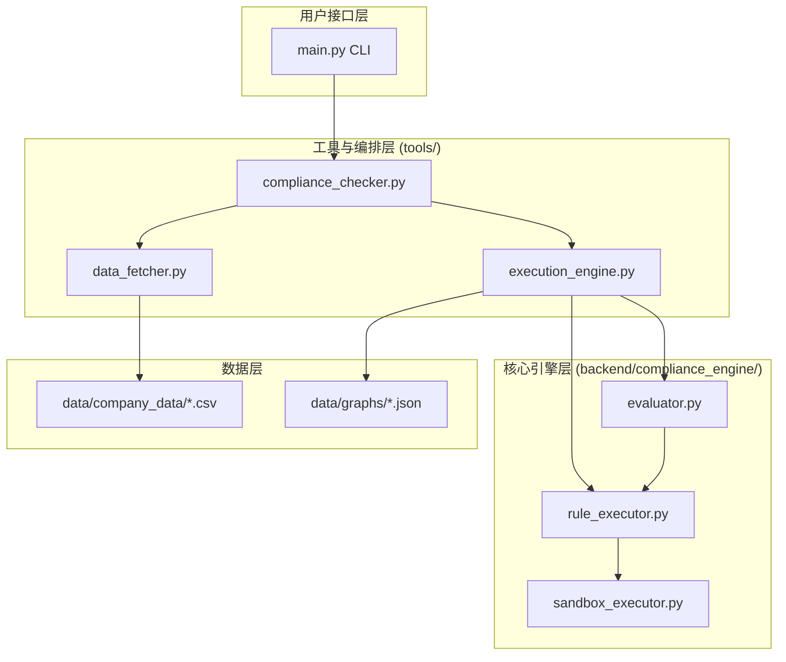

# Compliance-to-Code 系统设计文档

本文档作为 `README.md` 的补充，详细阐述了 Compliance-to-Code 系统的内部架构、工作流程和核心设计理念。

## 1. 核心概念

系统的基石是`ComplianceUnit`（合规单元）和由其构成的`ComplianceGraph`（合规图）。

### 1.1 ComplianceUnit (合规单元)

合规单元是将法律法规文本“原子化”拆解后的最小可验证单元。每个单元包含四个核心部分：

-   **Subject (适用主体)**：规定了该法规条款适用于哪类实体（例如：“上市公司”）。
-   **Condition (触发条件)**：描述了在什么特定情况下，该条款会被激活（例如：“实施竞价回购”）。
-   **Constraint (约束条件)**：定义了具体的合规要求或限制（例如：“回购期限不超过12个月”）。
-   **Code (执行代码)**：一段Python代码，用于根据真实数据量化判断 `Subject`、`Condition` 和 `Constraint` 的布尔状态（True/False）。

### 1.2 违规判定逻辑

系统的违规判定逻辑简单而明确，在`README.md`中也有提及：

> 当一个企业在 `Subject` 和 `Condition` 两个维度上都评估为 `True`，但其 `Constraint` 评估为 `False` 时，即构成一次**违规**。

任何其他组合（例如 `Subject` 为 `False`，或 `Condition` 为 `False`）均不构成违规，因为这意味着该企业要么不适用此条款，要么未触发该条款的检查条件。

### 1.3 ComplianceGraph (合规图)

一份完整的法规（如《股份回购指引》）由多个合规单元以及它们之间的逻辑关系构成。我们将这种结构抽象为`ComplianceGraph`。图中的节点是`ComplianceUnit`，边则代表它们之间的`Relation`（关系），例如条款的引用、排除等。

## 2. 系统分层架构

系统采用分层设计，将用户交互、业务流程编排和核心计算逻辑清晰地分离开来。

-   **用户接口层 (`main.py`)**: 系统的统一命令行入口，负责解析用户输入的命令和参数，并将任务分发给下一层。
-   **工具与编排层 (`tools/`)**: 扮演“项目经理”的角色。它不处理具体的合规计算，而是负责协调整个流程：准备数据 (`data_fetcher`)、启动核心引擎 (`execution_engine`)、调用评估器，并整理最终结果。
-   **核心引擎层 (`backend/compliance_engine/`)**: 系统的大脑和心脏。这里实现了所有与合规检查相关的核心计算逻辑，包括安全执行代码 (`sandbox_executor`)、应用规则 (`rule_executor`) 和判定违规 (`evaluator`)。
-   **数据层 (`data/`)**: 存放原始数据和结构化信息，包括公司财务/行为数据 (`company_data`) 和法规的图表示 (`graphs`)。

## 3. 详细工作流程解析

以执行 `python main.py check ...` 命令为例，系统内部的详细工作流程如下：

### 阶段一：命令解析与任务分发

1.  **`main.py`** 接收到 `check` 命令及其参数（公司、法规、日期等）。
2.  它定位到 `check` 命令对应的处理逻辑，即调用 `tools.compliance_checker` 模块的 `check_compliance` 函数。

### 阶段二：流程编排与数据准备

1.  **`tools/compliance_checker.py`** 开始执行。
2.  它首先会根据用户是否使用了 `--verbose` 标志来确定日志级别（`INFO` 或 `DEBUG`）。
3.  然后，它实例化 `tools.execution_engine.ExecutionEngine`，并将日志级别作为参数传入。`ExecutionEngine` 在初始化时会配置一个**全局的、根级别的日志记录器**，这意味着后续所有模块的日志都将遵循此配置。
4.  同时，`compliance_checker` 实例化 `tools.data_fetcher.DataFetcher`，并调用其 `get_company_data` 方法从相应的CSV文件中加载、筛选并返回所需的公司数据DataFrame。

### 阶段三：核心引擎执行

1.  **`tools/execution_engine.py` (`ExecutionEngine`)** 接管流程。
2.  它从 `data/graphs/` 目录加载对应的法规JSON文件，构建 `ComplianceGraph` 对象。
3.  它调用 **`backend/compliance_engine/evaluator.py` (`Evaluator`)** 的 `evaluate_company` 方法，并将公司数据和合规图传入。

### 阶段四：合规评估与规则执行

1.  **`backend/compliance_engine/evaluator.py` (`Evaluator`)** 是评估的核心。
2.  它首先对合规图进行拓扑排序，确定各个`ComplianceUnit`的执行顺序。
3.  它遍历图中的每一个单元：
    -   如果单元**没有** `code`，则标记为“定性分析”节点，跳过执行。
    -   如果单元**有** `code`，它将调用 **`backend/compliance_engine/rule_executor.py` (`RuleExecutor`)** 的 `execute_rule` 方法。

### 阶段五：沙盒代码执行

1.  **`backend/compliance_engine/rule_executor.py` (`RuleExecutor`)** 负责安全地执行代码。
2.  它首先对数据进行预处理（例如，转换日期格式）。
3.  然后，它调用 **`backend/compliance_engine/sandbox_executor.py` (`SandboxExecutor`)**。

4.  **`SandboxExecutor`** 的工作流程是保障安全的核心：
    a.  它将待执行的Python代码和公司数据（序列化后的DataFrame）写入一个临时的Python脚本文件。
    b.  它通过 `subprocess` 模块启动一个**全新的、独立的Python子进程**来运行这个临时脚本。
    c.  子进程在完全隔离的环境中执行计算。这可以防止恶意或有缺陷的代码影响主程序。
    d.  执行设有超时限制（默认为60秒），防止无限循环等问题。
    e.  子进程执行完毕后，将结果（处理后的DataFrame）序列化，并通过标准输出（stdout）返回给主进程。
    f.  主进程（`SandboxExecutor`）捕获输出，反序列化后得到结果，并删除临时脚本。

### 阶段六：结果分析与违规判定

1.  `Evaluator` 拿到 `RuleExecutor` 返回的、已包含 `_subject`, `_condition`, `_constraint` 列的DataFrame。
2.  它分析这个DataFrame，逐行检查是否满足 `subject=True`, `condition=True`, `constraint=False` 的违规条件。
3.  所有违规的记录都被汇总起来。
4.  最终，`Evaluator` 生成一个包含所有节点执行状态、违规详情和总体合规结论的详细结果字典。

### 阶段七：结果返回与输出

1.  结果字典沿调用链返回：`Evaluator` -> `ExecutionEngine` -> `ComplianceChecker` -> `main.py`。
2.  `main.py` 根据最终结果，在命令行中打印出简洁的摘要信息。
3.  同时，`ExecutionEngine` 会将完整的、包含所有细节的JSON结果报告保存到 `results/` 目录下。

这个完整、严谨的流程确保了合规检查的准确性、安全性和可追溯性。 