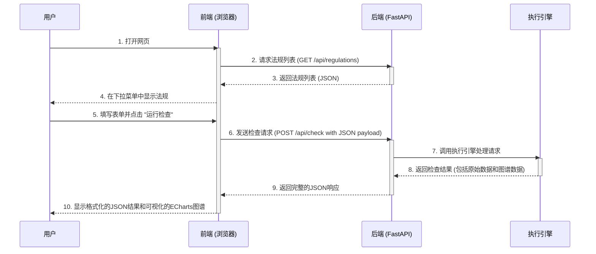

# Web 界面技术文档

本文档详细阐述了 Compliance-to-Code 项目的 Web 界面的架构、技术实现和使用方法。

## 1. 功能概述

Web 界面为用户提供了一个直观、可视化的方式来与合规检查引擎进行交互。用户无需编写代码或使用命令行，即可轻松完成以下操作：

-   动态加载并选择所有可用的法规。
-   输入公司名称和可选的日期范围来发起一次合规检查。
-   在检查过程中查看清晰的加载提示。
-   以交互式知识图谱的形式查看合规检查的结果，节点状态（合规、违规、失败等）一目了然。
-   同时查看原始的 JSON 格式详细报告。

## 2. 技术选型

Web 系统采用前后端分离的现代化架构。

### 2.1 后端

-   **框架**: [FastAPI](https://fastapi.tiangolo.com/)。一个基于 Python 3.7+ 类型提示的高性能 Web 框架，非常适合快速构建健壮的 API。
-   **服务器**: [Uvicorn](https://www.uvicorn.org/)。一个闪电般快速的 ASGI 服务器，是运行 FastAPI 应用的官方推荐。
-   **核心职责**:
    -   提供 API 接口来暴露核心引擎（`ExecutionEngine`）的功能。
    -   处理 HTTP 请求，调用引擎执行合规检查。
    -   将检查结果（包括为图表格式化的数据）序列化为 JSON 并返回给前端。
    -   托管前端的静态文件（HTML, CSS, JS）。

### 2.2 前端

-   **核心技术**: 原生 HTML, CSS, 和 JavaScript (ES6+)。不依赖任何重型前端框架，保持轻量和快速。
-   **图表库**: [Apache ECharts](https://echarts.apache.org/zh/index.html)。一个功能强大、配置灵活的数据可视化库，用于将合规单元及其关系渲染成知识图谱。
-   **自定义字体**: 使用 OPPO Sans 字体以提升界面的视觉美感和可读性。
-   **核心职责**:
    -   构建用户交互界面（表单、按钮等）。
    -   调用后端 API 获取法规列表和检查结果。
    -   处理用户输入和点击事件。
    -   使用 ECharts 将后端返回的图谱数据渲染成可交互的图表。
    -   美化页面布局和元素。

## 3. 运行指南

请遵循以下步骤来启动并使用 Web 界面。

**第一步：启动后端服务**

在项目的根目录下，执行我们提供的启动脚本：

```bash
python run_web_server.py
```

该命令会启动 Uvicorn 服务器，并加载 FastAPI 应用。服务成功启动后，会监听本地的 `8008` 端口。

**第二步：访问前端页面**

打开你的网络浏览器 (推荐 Chrome 或 Firefox)，然后访问以下地址：

[http://127.0.0.1:8008/](http://127.0.0.1:8008/)

由于后端已经配置为静态文件服务器，该地址会直接返回 `frontend/index.html` 页面。

## 4. API 端点说明

后端通过 `backend/app.py` 提供以下核心 API 端点：

### GET `/api/regulations`

-   **功能**: 获取所有已定义的、可供检查的法规列表。
-   **请求方式**: `GET`
-   **返回格式**: `application/json`
-   **成功响应示例**:
    ```json
    {
      "regulations": [
        {
          "id": "regulation_04",
          "name": "上市公司股份回购规则"
        },
        {
          "id": "regulation_08",
          "name": "上市公司股东及董监高减持股份的若干规定"
        }
      ]
    }
    ```

### POST `/api/check`

-   **功能**: 执行一次完整的合规检查。
-   **请求方式**: `POST`
-   **请求体格式**: `application/json`
    ```json
    {
      "regulation_id": "regulation_04",
      "company_name": "yiyu",
      "start_date": "2023-01-01", // 可选
      "end_date": "2023-12-31"    // 可选
    }
    ```
-   **成功响应示例**:
    返回一个包含两部分的 JSON 对象：`results` (原始评估结果) 和 `graph` (为 ECharts 格式化的图谱数据)。
    ```json
    {
      "results": {
        "company_name": "yiyu",
        "evaluation_time": "...",
        "summary": {
            "total_violations": 56,
            "overall_compliant": false
        },
        "regulations": {
            "regulation_04": {
                "unit_results": {
                    "cu_13_1": {"status": "Violation", ...},
                    "cu_25_1": {"status": "Success", ...}
                }
            }
        }
      },
      "graph": {
        "nodes": [
          {"id": "cu_13_1", "name": "...", "category": 1},
          {"id": "cu_25_1", "name": "...", "category": 0}
        ],
        "links": [
          {"source": "cu_13_1", "target": "cu_25_1"}
        ],
        "categories": [
          {"name": "合规"},
          {"name": "违规"},
          ...
        ]
      }
    }
    ```

### GET `/api/report/{result_path}`

-   **功能**: 获取指定结果的合规报告内容。
-   **请求方式**: `GET`
-   **参数**: 
    - `result_path`: 结果文件夹的名称，如 `20250718_032939_瑾煜农业_regulation_04`
-   **返回格式**: `application/json`
-   **成功响应示例**:
    ```json
    {
      "report": "# 瑾煜农业股份回购合规检查报告 (2020-2024)\n\n## 摘要\n本次对瑾煜农业执行《北京证券交易所上市公司持续监管指引第4号——股份回购》的专项检查发现：\n- **严重合规缺陷**：共检出14项违规行为，合规率仅26.3%（5/19）\n..."
    }
    ```
-   **失败响应**:
    - `404 Not Found`: 报告文件不存在或尚未生成
    - `500 Internal Server Error`: 服务器内部错误

### GET `/api/download/report/{result_path}`

-   **功能**: 下载指定结果的Markdown格式合规报告文件。
-   **请求方式**: `GET`
-   **参数**: 
    - `result_path`: 结果文件夹的名称
-   **返回格式**: `text/markdown`
-   **返回**: 直接返回文件下载响应

### GET `/api/download/json/{result_path}`

-   **功能**: 下载指定结果的JSON格式检查结果文件。
-   **请求方式**: `GET`
-   **参数**: 
    - `result_path`: 结果文件夹的名称
-   **返回格式**: `application/json`
-   **返回**: 直接返回文件下载响应

## 5. 架构与数据流

为了更清晰地理解前后端的协作方式，本节将详细描述系统架构和数据交互的完整流程。

### 5.1. 系统架构

系统采用了经典的单页应用（SPA）架构模式，具体特点如下：

-   **后端 (Backend)**:
    -   基于 **FastAPI** 的Python应用。
    -   职责：
        1.  提供一个符合RESTful风格的JSON API，用于核心业务逻辑（如法规查询和合规检查）。
        2.  作为静态文件服务器，直接托管前端的所有资源（HTML, CSS, JavaScript）。
    -   这种模式简化了部署，因为一个单独的服务器进程就能同时处理API请求和页面服务。

-   **前端 (Frontend)**:
    -   一个轻量级的单页面应用，使用原生 **HTML, CSS, 和 JavaScript** 构建。
    -   职责：
        1.  提供用户交互界面。
        2.  通过 `fetch` API 异步调用后端接口。
        3.  动态地将从后端获取的数据（如法规列表、检查结果）渲染到页面上。
        4.  使用 **ECharts** 库将复杂的图谱数据可视化。

### 5.2. 数据交互流程

下面的序列图详细展示了从用户打开网页到最终看到检查结果的完整交互流程：

