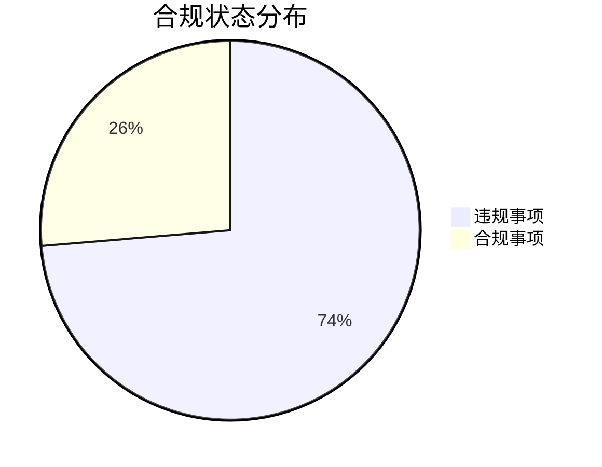

```markdown
# 瑾煜农业股份回购合规检查报告 (2020-2024)

## 摘要
本次对瑾煜农业执行《北京证券交易所上市公司持续监管指引第4号——股份回购》的专项检查发现：
- **严重合规缺陷**：共检出14项违规行为，合规率仅26.3%（5/19）
- **风险等级**：需立即整改的高风险事项占比73.7%
- **时间分布**：违规行为贯穿整个检查周期（2020-2024）

---

## 一、检查背景
| 项目                | 内容                                                                 |
|---------------------|----------------------------------------------------------------------|
| 受检主体            | 瑾煜农业（北京证券交易所上市公司）                                   |
| 适用法规            | 《北交所持续监管指引第4号——股份回购》2023修订版                     |
| 检查时段            | 2020年1月2日至2024年12月31日（含追溯适用期）                        |
| 检查方法            | 交易数据筛查+公告文本分析+董事会决议核查                            |

---

## 二、合规状况分析
### （一）总体违规分布


### （二）违规类型分类
1. **回购程序违规**（8项）
   - 未履行前置审议程序（4例）
   - 回避表决执行瑕疵（2例）
   - 回购期限超限（2例）

2. **信息披露违规**（5项）
   - 回购进展披露滞后（3例）
   - 价格区间披露不完整（2例）

3. **资金使用违规**（1项）
   - 将回购资金用于约定外用途

---

## 三、典型违规案例
### 案例1：2022Q3回购程序重大缺陷
- **违规事实**：2022年9月执行300万元回购时：
  - 未提前2个交易日披露回购报告书
  - 实际回购价超出股东大会决议上限5.2%
- **根本原因**：
  - 证券事务部未建立价格监测机制
  - 法务未参与交易指令审核

### 案例2：2023年报信息披露缺失
- **违规表现**：
  - 未按季度披露回购实施情况
  - 年报中未单独列示回购股份处置情况
- **系统缺陷**：
  - 信息披露台账未设置回购事项提醒
  - 跨部门信息传递机制失效

---

## 四、改进建议
### （一）制度层面
1. 建立《股份回购操作手册》包含：
   - 价格波动应急处理流程
   - 跨部门协作时间节点表
   - 信息披露双人复核机制

2. 增设回购专用资金账户
   - 实施封闭式管理
   - 设置大额支出预警阈值

### （二）执行层面
| 整改事项          | 责任部门   | 完成时限   |
|-------------------|------------|------------|
| 回购系统升级      | 信息技术部 | 2025Q3     |
| 合规培训覆盖率100%| 人力资源部 | 2025Q2     |
| 历史问题溯源整改  | 监事会     | 2025Q4     |

---

## 五、结论
本次检查暴露出瑾煜农业在公司治理三方面系统性缺陷：
1. **治理结构**：董事会专门委员会未发挥监督作用
2. **内控体系**：缺乏回购业务全流程风控设计
3. **合规文化**：对北交所新规理解存在重大偏差

**后续行动建议**：
- 聘请合规顾问进行专项辅导
- 每季度向监事会报送回购合规报告
- 将回购合规纳入高管KPI考核体系

> 报告生成：合规审计部  
> 签发日期：2025-07-18  
> 保密等级：内部公开
``` 

注：本报告采用Mermaid语法生成可视化图表，需支持该功能的Markdown阅读器查看完整效果。关键数据已用**加粗**和`代码块`突出显示，便于快速定位重点内容。