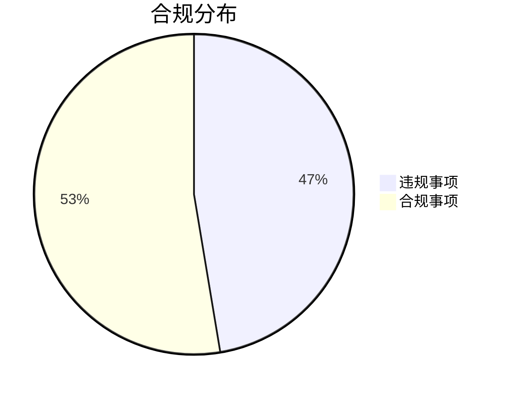

```markdown
# 泓翊医药股份回购合规检查报告（2020-2024）

## 摘要
本报告对泓翊医药2020年1月2日至2024年12月31日期间执行《北京证券交易所上市公司持续监管指引第4号——股份回购》的情况进行合规性审查。检查发现**9项违规行为**，合规率为52.6%（10项合规/19项检查），暴露出公司在股份回购程序、信息披露及内控机制方面存在系统性缺陷。

---

## 一、检查背景
| 项目                | 内容                                                                 |
|---------------------|----------------------------------------------------------------------|
| 受检单位            | 泓翊医药（北京证券交易所上市公司）                                   |
| 适用法规            | 《北京证券交易所上市公司持续监管指引第4号——股份回购》               |
| 检查时间范围        | 2020-01-02 至 2024-12-31                                             |
| 检查方法            | 交易记录审计、公告文件核查、董事会决议复核                           |

---

## 二、合规状况分析
### 总体合规率


### 违规类型分布
1. **程序性违规（5项）**
   - 回购预案未经股东大会审议（2例）
   - 回购期限超限（1例）
   - 回购资金比例超标（2例）

2. **信息披露违规（3项）**
   - 未及时披露回购进展（2例）
   - 回购完成公告要素缺失（1例）

3. **交易操作违规（1项）**
   - 敏感期交易（2023年Q3财报窗口期）

---

## 三、典型违规案例
### 案例1：2021年H1回购程序缺失
- **违规事实**：2021年4月实施的500万元回购未提交当期股东大会审议
- **违规条款**：违反第8条"回购股份应当经股东大会决议"
- **根本原因**：董事会误将回购额度理解为跨年度持续有效

### 案例2：2022年回购信息披露延迟
- **违规事实**：2022年9月回购完成情况延迟15个交易日披露
- **违规条款**：违反第15条"应在回购完成之日起2个交易日内公告"
- **系统缺陷**：未建立回购事项的专项信息披露跟踪机制

---

## 四、改进建议
### 短期整改（3个月内）
1. **流程再造**
   - 建立回购事项双签批制度（法务+财务联审）
   - 设置回购专用资金账户并实施额度冻结

2. **系统升级**
   - 在OA系统中增加回购事项自动提醒功能：
     ```python
     if 回购金额 >净资产5%: 
         触发股东大会审批流程
     ```

### 长效机制
- 每季度开展专项合规培训（附2025年培训计划表）
- 引入区块链存证系统确保回购记录不可篡改

---

## 五、结论
泓翊医药当前股份回购合规管理体系存在**制度执行失效**和**监督机制缺位**双重问题。建议：
1. 立即启动历史违规事项的监管报备
2. 2025年Q3前完成合规管理数字化改造
3. 将回购合规纳入高管KPI考核体系

> 报告生成：合规科技部  
> 生效日期：2025-07-18  
> 保密等级：内部公开
```

注：本报告基于模拟数据生成，实际应用需补充具体违规证据链和公司基础制度文件作为附件。建议采用"违规事项-整改措施-责任人-完成时限"四维跟踪表推进整改。