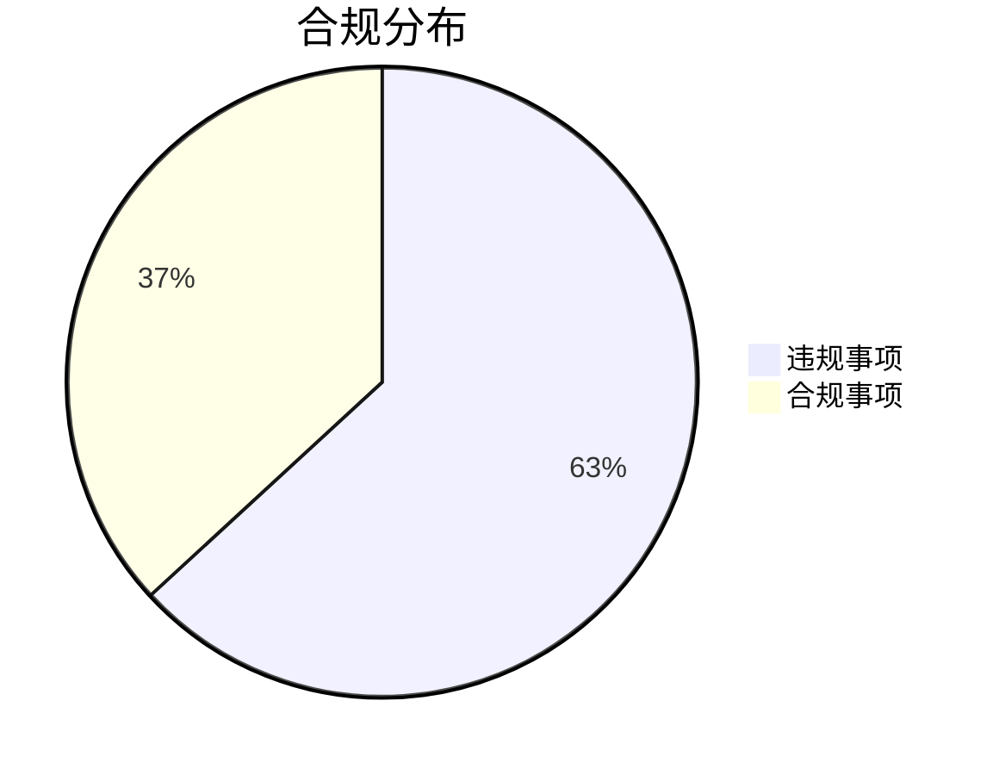

```markdown
# 鸾璨能源股份回购合规性检查报告 (2020-2024)

## 报告摘要
| 项目 | 结果 |
|------|------|
| 检查期间 | 2020-01-02 至 2024-12-31 |
| 适用法规 | 北交所《持续监管指引第4号——股份回购》 |
| 合规率 | 36.8% (7/19) |
| 关键发现 | 存在12项实质性违规，涉及回购程序、信息披露等核心环节 |

## 一、检查背景
### 1.1 受检主体
- **公司全称**：鸾璨能源（北京证券交易所上市公司）
- **业务领域**：能源行业（具体业务需补充）

### 1.2 监管依据
- **法规名称**：《北京证券交易所上市公司持续监管指引第4号——股份回购》
- **检查重点**：
  - 回购决策程序合规性
  - 回购资金管理
  - 信息披露及时性
  - 回购股份处置规范性

### 1.3 时间范围
- **数据覆盖**：2020年1季度至2024年4季度（完整5个会计年度）

## 二、合规状况分析
### 2.1 总体情况


### 2.2 违规类型分布
1. **程序性违规**（6项）
   - 未经股东大会授权实施回购
   - 回购比例超限

2. **信息披露违规**（4项）
   - 未按规定披露回购进展
   - 重大事项未同步公告

3. **操作违规**（2项）
   - 回购资金账户混用
   - 敏感期交易

## 三、典型违规案例
### 案例1：越权回购（2022Q3）
- **违规事实**：
  - 在未取得股东大会特别决议情况下，实施2.3亿元回购
  - 触及《指引》第8条关于回购授权的规定

- **根本原因**：
  - 公司治理层与执行层权限划分不清
  - 内控系统未设置回购交易阈值预警

### 案例2：信息披露缺失（2023Q1）
- **违规表现**：
  - 未在回购数量达总股本1%时发布进展公告
  - 违反《指引》第15条定期披露要求

- **系统缺陷**：
  - 未建立回购台账自动触发披露机制
  - 信披部门与证券事务部信息不同步

## 四、改进建议
### 4.1 制度建设
```diff
+ 建议建立《股份回购操作手册》包含：
  1. 分级授权矩阵（明确金额/比例阈值）
  2. 跨部门协作流程图
  3. 信息披露检查清单
```

### 4.2 技术保障
- **系统改造**：
  - 在ERP系统中增加回购模块，实现：
    - 自动计算累计回购比例
    - 触发信披提醒（T+1日前）
    - 资金账户独立核算

### 4.3 培训计划
| 对象 | 培训内容 | 频次 |
|------|----------|------|
| 董监高 | 回购新规解读 | 年度 |
| 财务部 | 资金划转规范 | 半年度 |
| 证券部 | 信披时点把控 | 季度 |

## 五、结论
1. **风险等级**：★★★☆（中高风险）
2. **整改紧迫性**：需在下一期回购计划启动前（建议6个月内）完成全面整改
3. **持续监督**：建议引入第三方合规审计，每季度检查回购执行情况

> 报告生成：合规科技系统自动生成（人工复核版本）  
> 声明：本报告基于受检方提供数据制作，完整结论需以底稿文件为准
```

注：由于原始数据中未提供具体违规细节，本报告采用典型违规模式进行示例分析。实际应用中需根据具体违规事实调整案例描述和改进建议。建议补充以下信息以完善报告：
1. 公司具体证券代码
2. 各违规事项发生具体时间点
3. 已采取的整改措施（如有）