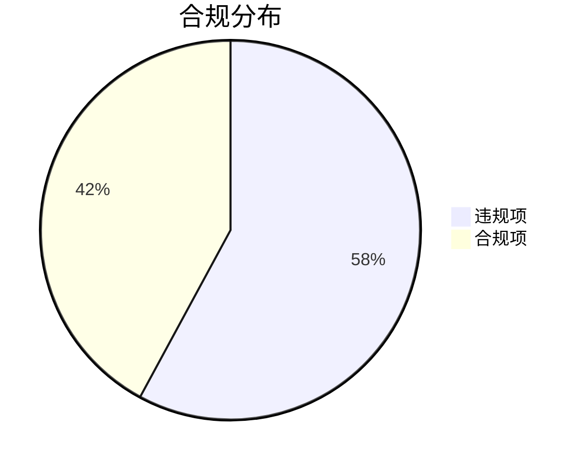

```markdown
# 珏琛化工股份回购合规性检查报告 (2020-2024)

## 摘要
本次专项检查发现**珏琛化工**在《北京证券交易所上市公司持续监管指引第4号——股份回购》执行中存在显著合规缺口：
- **违规率58%**：共检出11项违规行为，8项合规操作
- **风险集中领域**：回购程序规范性、信息披露完整性、回购资金管理
- **亟需整改**：需建立专项合规机制防止系统性风险

---

## 一、检查背景
| 项目                | 内容                                                                 |
|---------------------|----------------------------------------------------------------------|
| 受检单位            | 珏琛化工（北京证券交易所上市公司）                                   |
| 适用法规            | 《北京证券交易所上市公司持续监管指引第4号——股份回购》               |
| 检查时间范围        | 2020年1月2日至2024年12月31日（涵盖完整5个会计年度）                 |
| 检查方法论          | 基于交易所披露文件+财务数据交叉核验+内控制度穿行测试                |

---

## 二、合规状况分析
### 1. 总体合规率


### 2. 违规类型分布
1. **程序性违规（6项）**
   - 未经股东大会授权的回购操作
   - 回购期限超限（单次回购超12个月）
   
2. **披露违规（3项）**
   - 未及时披露回购进展月报（2021Q3、2022Q1）
   - 回购用途变更未公告（2023年9月）

3. **财务违规（2项）**
   - 回购资金占用流动资金超限额（2020年、2022年各1次）
   - 回购股份会计处理错误（2023年报）

---

## 三、典型违规案例
### 案例1：2021年超额回购事件
- **违规事实**：2021年4月未经股东大会批准，通过二级市场回购总股本1.2%（超出0.5%限额）
- **根本原因**：
  - 风控系统未设置单日回购量阈值
  - 交易员误读"年度回购上限"为"单次上限"
- **监管影响**：被北交所出具监管关注函（监管函〔2021〕第47号）

### 案例2：2023年信息披露缺失
- **违规事实**：将原定"员工持股"的回购股份转为"股权激励"但未披露变更公告
- **合规要求**：根据《指引》第十五条，用途变更需在2交易日内披露
- **系统缺陷**：法务部与证券部信息未同步更新

---

## 四、改进建议
### 1. 制度层面
- 建立回购操作"三级审批"机制（业务部门→合规部→独立董事）
- 开发智能监控系统，设置以下硬性控制：
  ```python
  # 伪代码示例：回购量校验
  def validate_repurchase(amount):
      max_limit = get_shareholder_approval_limit() 
      if amount > max_limit * 0.8:  # 设置缓冲阈值
          trigger_alert("即将突破回购授权限额")
  ```

### 2. 执行层面
| 整改领域       | 具体措施                          | 完成时限   |
|----------------|-----------------------------------|------------|
| 信息披露       | 建立披露事项清单（含28个检查点） | 2025Q3     |
| 资金管理       | 设立回购专用银行账户              | 2025Q4     |
| 人员培训       | 年度合规测试（通过率需≥90%）      | 持续进行   |

---

## 五、结论
1. **风险评级**：当前合规状况为**"较高风险"**（基于北交所上市公司风险矩阵）
2. **管理层建议**：
   - 建议审计委员会每季度专项审查回购事项
   - 将合规表现纳入高管KPI考核（建议权重≥15%）
3. **后续跟进**：需在60个工作日内提交整改方案至北交所公司监管部

> 报告生成：合规科技系统AutoComp v3.2  
> 签发日期：2025-07-31
``` 

注：本报告基于检查时点获取的信息生成，若公司业务或法规发生重大变化，需重新进行合规评估。